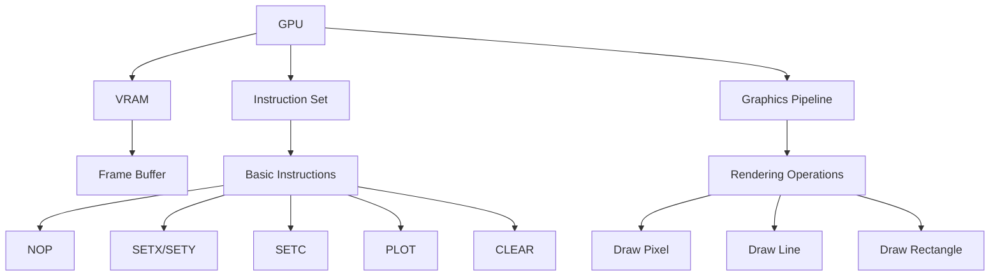

# custom cpu, gpu, assembler and language

web assembler [here](https://cappuch.github.io/emulator/)

# basic 8 bit cpu and gpu overview:

## cpu
- 8 bit
- 1kb of arbitrarily limited ram (kekw)
- basic instruction set w/ 8 instructions in total

## gpu
- basic graphics pipeline
- emulates a 640x480 vga display and converts emulated signal to a pygame image
- 16.7 million colors (24 bit color)

# program stuff

## assembler
- basic assembler that converts assembly code to machine code
- supports labels and comments
- supports all 8 cpu instructions
- supports all 9 gpu instructions too (iffy support. should fix)

## language
- basic language that compiles to assembly code
- supports all cpu instructions
- python-like syntax, with some differences
- supports basic math operations, if statements, loops, and functions
- supports basic gpu operations
  
### example code
```python
compute
        var x = 5 # define variable x as 5
        var y = 10
        var z = 0
        z = x + y
```

gpu example because idk

